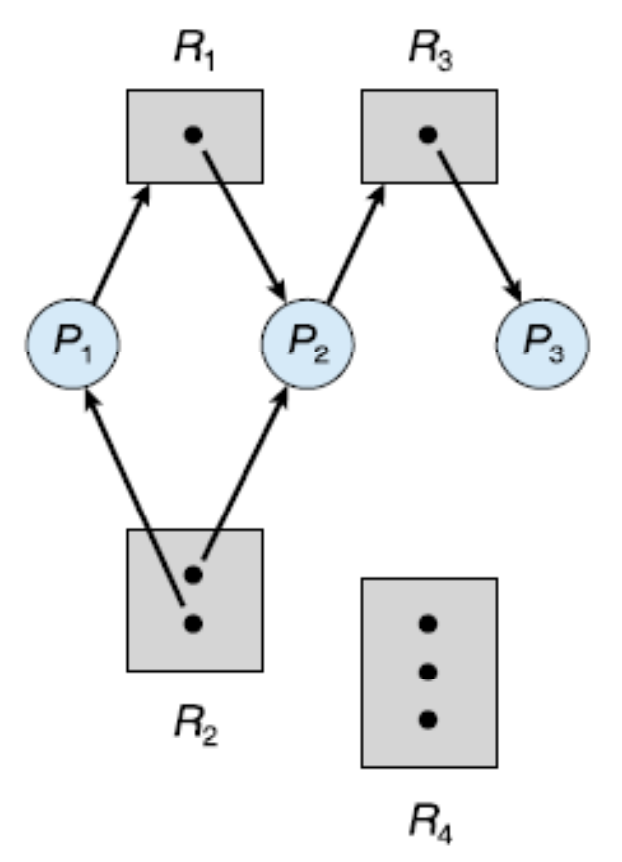
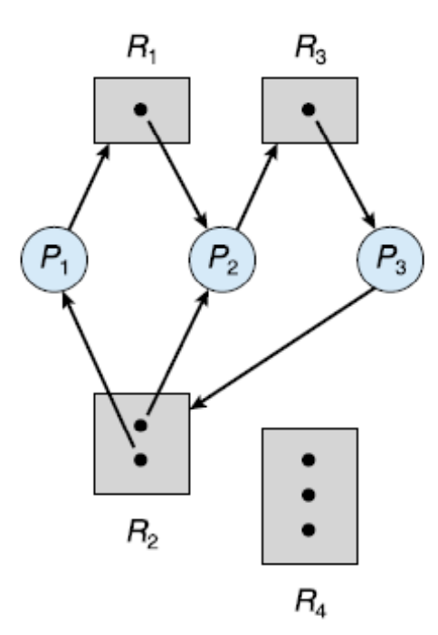
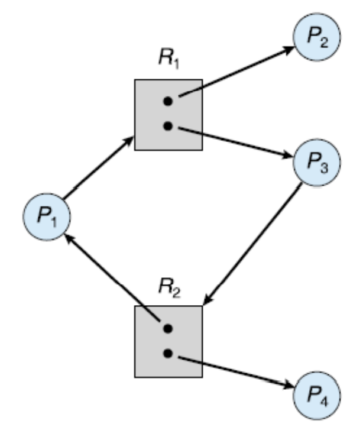

# 교착상태(Deadlocks)
대기 중인 프로세스들이 서로 점유하고 있는 자원을 요청해 그 상태를 벗어나지 못할 때 그것을 '교착상태'라고 한다. 보통 운영체제는 교착상태를 예방하는 기능을 제공하지 않기 때문에 교착상태를 막는 것은 전적으로 프로그래머의 책임이다. 더 많은 프로세스, 스레드, 자원을 사용하는 요즘 추세에서는 교착상태가 더더욱 일상적인 문제가 될 것이다.

## 시스템 모델(System Model)
시스템은 경쟁하는 프로세스들 사이에 분배되어야 할 유한한 수의 자원들로 구성된다. 이들 자원은 다수의 타입으로 분할되며, 각각의 자원은 인스턴스로서 존재한다. 예를 들어 CPU 같은 경우 시스템이 두 개의 CPU를 가진다면 두 개의 인스턴스를 가지는 셈이 된다.

프로세스는 작업을 수행하기 위해 자원을 사용하는 데 정상적인 작동 모드 하에서 다음 과정을 거친다.

1. 요청: 프로세스는 자원을 요청한다. 요청이 즉시 허용되지 않으면(예: 다른 프로세스가 그 자원을 점유하고 있는 경우) 자원을 얻을 때까지 대기해야 한다.
2. 사용: 프로세스는 자원에 대해 작업을 수행할 수 있다.
3. 방출: 프로세스가 자원을 방출한다.

자원의 요청과 방출은 장치의 `request()`와 `release()`, 파일의 `open()`과 `close()`, 메모리의 `allocate()`와 `free()` 같은 시스템 호출로 이루어진다. 프로세스나 스레드가 커널의 자원을 사용할 때마다 운영체제는 자원의 요청/할당 여부를 기록한다.

한 프로세스 집합 내의 모든 프로세스가 그 집합 내의 다른 프로세스에 의해서만 발생될 수 있는 사건을 기다린다면, 그 프로세스 집합은 교착상태에 있다. 이 때 우리의 주 관심 사건은 자원의 획득과 방출이며 자원에는 물리적 자원(프린터, CPU 주기, 메모리 공간)과 논리적 자원(세마포, mutex 락, 파일)을 포함한다.

## 교착상태의 특징(Deadlock Characterization)

### 필요조건들(Necessary Conditions)
교착상태는 다음 네가지 조건이 동시에 성립할 때 발생할 수 있다.

1. 상호 배제(Mutual exclusion): 한 번에 하나의 프로세스만이 자원을 사용할 수 있다. 다른 프로세스가 점유되고 있는 자원을 요청할 경우 방출될 때까지 반드시 대기해야 한다.
2. 점유하며 대기(Hold-and-wait): 프로세스는 최소한 하나의 자원을 점유한 채, 현재 다른 프로세스에 의해 점유된 자원을 추가로 얻기 위해 반드시 대기해야 한다.
3. 비선점(No preemption): 자원들을 선점할 수 없어야 한다. 즉, 자원이 강제적으로 방출될 수 없고, 점유하고 있는 프로세스가 자발적으로 방출하는 것만 허용된다.
4. 순환 대기(Circular wait): 프로세스끼리 순환적으로 대기하는 경우를 말한다. 예를 들어 프로세스 *P0* 가 *P1* 이 점유한 자원을 대기하고, *P1* 이 *P2* 가 점유한 자원을 대기하고, *P2* 가 *P0* 가 점유한 자원을 대기할 때를 말한다.

위의 네 조건은 완전히 독립적인 것은 아니지만 교착상태 예방을 위해서는 별개로 보는 것이 유용하다.

### 자원 할당 그래프(Resource-Allocation Graph)
교착 상태를 보다 정확하게 기술할 수 있는 그래프로 정점(vertex) *V*의 집합과 간선(edge) E의 집합으로 구성된다.

정점 *V*의 집합은 두 가지 타입으로 구별된다.
- 시스템 내의 모든 **활성 프로세스** 의 집합 *P* = {*P1*, *P2*..., *Pn*}
- 시스템 내의 모든 **자원 타입** 의 집합 *R* = {*R1*, *R2*..., *Rm*}

방향 간선(directed edge)도 그 방향에 따라 두 가지로 나뉘어 진다.
- *Pi* -> *Rj*의 방향 간선은 **요청 간선(request edge)** 라 부른다.
- *Rj* -> *Pi*의 방향 간선은 **할당 간선(assignment edge)** 라 부른다.

프로세스가 자원을 요청하면 요청 간선이 자원 할당 그래프 안에 삽입되는데 이 때 가용 자원이 있으면 할당 간선으로 변환된다.

그래프가 사이클을 포함하지 않으면 어느 프로세스도 교착상태가 아니라고 말할 수 있지만 사이클을 포함한다면 교착상태가 존재할 수도 있다. 만약 각 자원 타입이 하나의 인스턴스만 가진다면 교착 상태가 발생하였다는 것을 알려준다. 그러나 여러 인스턴스가 존재하는 경우 사이클이 반드시 교착상태를 의미하지는 않는다.

예를 들어 다음 그림을 보자.

다음 그림을 보면 두 개의 사이클이 존재한다는 것을 알 수 있다.
- *P1* -> *R1* -> *P2* -> *R3* -> *P3* -> *R2* -> *P1*
- *P2* -> *R3* -> *P3* -> *R2* -> *P2*

위의 세 프로세스는 교착 상태로 서로가 점유한 자원을 대기하고 있는 상태로 교착상태이다.

그런데 다음 그림을 보자.

다음 그림에서도 사이클을 발견할 수 있다.
- *P1* -> *R1* -> *P3* -> *R2* -> *P1*

하지만 *R1* 의 자원은 *P2* 가, *R2* 의 자원은 *P4* 가 방출할 가능성도 있므으로 그 때는 사이클이 없어진다.

이러한 관찰은 우리가 교착상태를 다루는 데 중요하다.

## 교착상태 처리방법(Methods of Handling Deadlocks)
원칙적으로 교착상태 문제를 처리하는 데는 세 가지 방법이 있다.
- 시스템이 결코 교착상태가 되지 않도록 **예방**하거나 **회피**하는 프로토콜을 사용.
- 시스템이 교착상태가 되도록 허용한 다음 회복시키는 방법.
- 문제를 **무시**하고, 교착상태가 시스템에서 결코 발생하지 않는 척하기.

위 방법 중 세 번째 방법이 Linux와 Windows를 포함해 가장 많이 쓰이는 방법이며 이는 비용적인 측면을 고려한 것이다.

## 교착상태 예방(Deadlock Prevention)
교착상태가 발생하는 네 가지 조건 중 최소한 하나가 성립되지 못하게 함으로써 예방하는 방법이다. 네 가지 조건들을 각각 검토해보자.

### 상호 배제(Mutual Exclusion)
일반적으로 상호 배제 조건을 거부함으로써 교착상태를 예방하는 것은 불가능하다. 읽기-전용 파일 같은 공유 가능한 자원은 배타적인 접근을 요구하지 않아 교착상태와 관련되지 않지만 mutex 락 같은 자원은 근본적으로 공유가 불가능하다.

### 점유하며 대기(Hold and Wait)
이 조건을 막으려면 프로세스가 자원을 요청할 때 점유하고 있는 자원이 없음을 우리가 반드시 보장해야 한다. 여기에는 두 가지 프로토콜이 있다.
- 각 프로세스가 실행되기 전에 자신이 필요한 모든 자원을 요청하고 할당받을 것을 요구. 우리는 한 프로세스를 위해 자원을 요청하는 시스템 호출이 모든 시스템 호출보다 앞서도록 하여 구현할 수 있음.
- 자원을 갖고 있지 않을 때만 자원을 요청할 수 있게끔 함.

위의 방법들에는 두 가지 중요한 단점이 존재한다.
1. 이용도가 낮음: 많은 자원들이 할당된 후 오랫동안 사용되지 않기 때문에 자원의 이용도가 낮을 수 있다.
2. 기아 상태가 가능: 자주 쓰이는 자원을 필요로 하는 프로세스의 경우 할당을 못 받아 무한정 대기할 수도 있다.

### 비선점(No Preemption)
이 조건이 성립하지 않기 위해 우리는 다음의 방법을 사용할 수 있다.
- 점유하고 있는 자원을 요청할 경우 한 프로세스가 그 자원을 점유하고 있더라도 방출함.
- 한 프로세스가 자원을 요청했을 때 사용이 불가능 하면, 그 자원을 점유하고 있되 작업을 위해 추가적인 자원을 대기하고 있는 프로세스한테서 뺏어와 할당한다. 만약 그렇지 않다면 대기해야 한다.

위의 방법들은 CPU 레지스터나 메모리 공간처럼 그 상태가 쉽게 저장되고 복원이 가능한 자원의 경우에 종종 적용되며 일반적으로 mutex나 세마포어 같은 자원에는 적용될 수 없다.

### 순환 대기(Circular Wait)
순환 대기 조건이 성립되지 않는 한 가지 방법은 모든 자원 타입들에게 전체적인 순서를 부여하여 각 프로세스가 열거된 순서대로 오름차순으로 자원을 요청하도록 요구하는 것이다.

예를 들어 자원 타입의 집합 *R* = {*R1*, *R2*..., *Rm*}이 있을 때 각 프로세스는 오름차순으로만 자원을 요청할 수 있도록 한다. 일대일 함수인 *F*: *R* -> *N*(자연수의 집합)는 순서를 나타내는 자연수를 반환한다고 하자. 그러면 프로세스는 *F*(*R**j*) > F(*R**i*)를 만족할 때만 자원 *R**j*의 인스턴스를 요청할 수 있다. 순서대로 요청할 수 있다는 의미이다.

다른 대안으로는 프로세스가 자원 타입 *R**j*을 요청할 때마다 *F*(*R**j*) <= F(*R**i*)인 모든 자원 *R**i*을 방출하도록 요구하는 방법이 있다. 즉, 상위 순서의 자원을 모두 토해내야 한다는 것이다.

위의 두 프로토콜에서 또 유의할 점은 동일한 유형의 자원을 여러 개 할당받을 경우 단 한번의 요청으로 받아야 한다는 점이다. 이 두 프로토콜은 순환 대기 조건이 발생하지 않으며 이것은 순환대기가 발생한다고 가정하는 귀류법으로 증명이 가능하다.

> *cf) 순서나 계층 구도를 정하는 것 자체만으로 교착상태를 예방할 수 없고 그것을 지키는 프로그램을 짜는 것은 온전히 프로그래머의 몫이다. 또한 자원이 사용되는 정상적인 순서를 고려해 순서를 짜야한다.*

## 교착상태 회피(Deadlock Avoidance)
교착상태를 예방하는 방법은 요청에 제한을 두어 교착상태가 이루어지는 네 가지 조건 중 최소 하나를 막는 방법이다. 하지만 이 방법의 중요한 단점은 장치의 `이용률`이 저하되고 `시스템 처리율(throughput)`이 감소된다는 점이다.

만약 '자원이 어떻게 요청될 지 미리 파악하고 그에 따른 알고리즘을 짤 수 있다면?'하는 생각에서 비롯된 것이 `교착상태 회피`이다. 각 프로세스의 요청과 방출에 대한 완전한 순서를 파악하고 있다면 우리는 각 요청에 대해서 가능한 미래의 교착상태를 피하기 위해 프로세스가 대기해야 하는지 여부를 결정할 수 있다.

### 안전 상태(Safe State)
시스템 상태가 안전하다는 말은 `시스템이 어떤 순서로든 프로세스들이 요청하는 모든 자원을 교착상태를 야기시키지 않고 차례로 모두 할당해 줄 수 있는 상태`를 말한다. 즉, **안전 순서(safe sequence)** 를 찾아야 한다. 안전 순서란 어떤 프로세스 *P**i*에 대해 그 *P**i*가 요청하는 자원을 시스템에 현재 남아있는 자원과 앞에서 수행을 마칠 모든 프로세스 *P**j*(*j* < *i*)들이 반납하는 자원들로 만족시켜 줄 수 있음을 뜻한다.

시스템이 안전하다는 것은 교착상태가 없다는 것을 의미한다. 그러나 시스템이 불안전하다고 항상 교착상태로 빠진다는 것은 맞지 않다. 교착상태로 언제든지 빠질 수 있는 가능성을 내포하고 있으며 이는 프로세스들의 행동 양태에 따라 달라진다.

또한 시스템은 안전 상태에서 불안전 상태로 언제든지 빠질 수 있다. 그러므로 프로세스가 자원을 요청할 때 바로 들어줄지, 미루고 기다리게 해야 할지를 결정해야 한다. 이 때문에 자원의 이용률은 회피를 쓰지 않을 때보다 낮아질 수 밖에 없다.

### 자원 할당 그래프 알고리즘(Resource-Allocation Graph Algorithm)
기존의 자원 할당 그래프에 `예약 간선(claim edge)`을 추가하여 하는 방법으로 기존의 그래프에 프로세스가 실행되기 전 예약 간선을 점선으로 표시하여 요청 간선이 될 것을 명시해 해두는 것이다. 즉, 프로세스가 어떠한 요청을 할 것인지 미리 알아야 한다.
