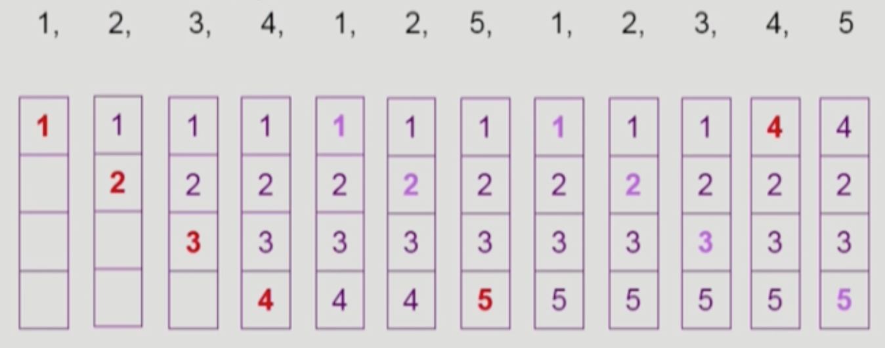

# 가상 메모리 Part 1

## 배경

물리 메모리에 프로세스를 적재하는 일에는 운영체제가 관여하지 않는다.
그러나 가상 메모리에 관하여는 전적으로 운영체제가 관여한다.

## 요구 페이지

요청이 있을 때 페지를 메모리에 올리는 방식

장점
- I/O 양 감소
- 메모리 사용량 감소
- 응답 시간 감소: system-wise한 관점, 하나의 프로세스 관점 아님.
- 사용자 수용력 증가

### 유효-무효 비트 (Valid-invalid Bit)

페이지 테이블은 프레임과 유효-무효 비트로 구성되어 있다.

유효-무효 비트의 의미는 각각 다음과 같다.
- 유효 비트 (Valid bit): 페이지가 물리 메모리에 올라 사용 중인 경우
- 무효 비트 (Invalid bit)
  - 페이지가 물리 메모리에 없는 경우, 즉 swap area(backing store)에 내려가 있는 경우
  - 일부 사용하지 않는 주소 영역인 경우

모든 페이지 entry는 처음에 무효 비트로 초기화된다.

### 페이지 폴트 (Page Fault)

페이지 폴트란 찾으려는 페이지가 물리 메모리에 존재하지 않는 것을 뜻한다. 주소 변환 시 무효 비트로 set되어 있으면 페이지 폴트가 발생한다. 페이지 폴트 trap이 발생하면 CPU 제어권은 자동적으로 운영체제에게 넘어간다. 페이지 폴트가 발생하고 처리되는 과정은 다음과 같다.

이거 다시!
1. 적재된 프로세스 M으로부터 논리 주소에 대한 요청이 들어온다.
2. 페이지 테이블에 주소가 올라와 있지 않으므로 페이지 폴트 handler에 의해 interrupt가 invoke된다.
3. 디스크에 접근하여 요청한 주소에 해당하는 것을 찾는다.
4. 비어 있는 페이지 프레임을 찾는다. 없으면 디스크로부터 load한다.
5.
6.

### 요구 페이지의 성능

페이지 폴트율(page fault rate)은 0에서 1 사이
- 0: 발생하지 않음
- 1: 매번 발생

유효 접근 시간(effective access time)은 다음 두 가지의 합.
- 페이지 폴트가 발생하지 않는 시간: `(1-p) * memory access`
- 페이지 폴트가 발생하는 시간: `p * 페이지 폴트 처리시간`
  - 페이지 폴트 처리시간은 매우 길어질 수 있으므로 가능한 한 p를 작게 하는 것이 바람직하다.

## Copy-on-write

## 페이지 교체

비어있는 프레임이 없는 경우에는 프레임을 빼앗아와야 한다.(victim page)
곧바로 사용하지 않을 페이지를 쫓아내는 것이 좋음
동일한 페이지가 여러 번 메모리에서 쫓겨나고 돌아오는 일이 반복될 수 있음

페이지 교체 알고리즘을 통해 어떤 페이지를 쫓아낼 지 결정한다. 페이지 폴트율을 최소화하는 것이 목표.
reference string: 1 2 3 4 1 2 5 1 2 3 4 5

#### References
- 운영체제 강의, 반효경, 이화여자대학교, 2017
- 공룡책

---

# 가상 메모리 Part 2

## 페이지 교체 알고리즘

### Optimal Page Replacement (OPT)

페이지 폴트 6회 발생

- 가장 오랫동안 사용되지 않을 페이지를 찾아 교체하는 방식
- 페이지 폴트가 가장 적은 좋은 알고리즘, 그러나 미래를 알고 있다는 가정이 비현실적
- 다른 알고리즘 성능에 대한 upper bound 제공
- 다른 이름: offline, Belady's, MIN, OPT

### FIFO

페이지 폴트 9회 -> 10회

먼저 들어온 것을 먼저 내쫓는 방식

FIFO anomaly(Belady's anomaly): 페이지 프레임 수를 늘렸는데도 페이지 폴트가 더 발생하는 경우가 있다.

### LRU

페이지 폴트 8회

Least-Recently-Used Algorithm

미래를 모른다면 과거를 보라. 과거에 가장 오랫동안 사용되지 않은 페이지를 내쫓는다. 최근에 사용했을수록 앞으로도 다시 사용할 확률이 높다는 가정.

#### 구현

스택 형태로, 페이지가 참조될 때마다 페이지 번호는 스택의 bottom에 놓이게 된다. top에 있는 것이 가장 오랫동안 참조되지 않은 페이지로서 제거될 대상이다. 링크드 리스트 형태로 구현한다고 해도 O(1) 복잡도이다.

### LFU

Least-Frequently-Used Algorithm

참조 횟수(빈도)가 가장 적은 페이지를 내쫓는다.

특징
- LRU처럼 시점만 보는게 아니라 장기적인 시간을 보기 때문에 페이지 인기도를 더 정확히 판단
- 반대로 최근성은 반영 못함
- 구현이 더 복잡

#### 구현

LRU처럼 연결 리스트 기반의 스택으로 구현하면 매번 참조횟수를 비교해야 하므로 복잡도가 O(n)이 된다. 따라서 스택 대신 힙 형태로 구현한다. 최상단 노드가 참조횟수가 가장 적은 것이고 아래로 갈수록 많은 것이다. 이 경우 복잡도는 O(logn)이다.

### Clock Algorithm

## 프레임 할당

## 쓰레싱

## 페이지 크기 결정
