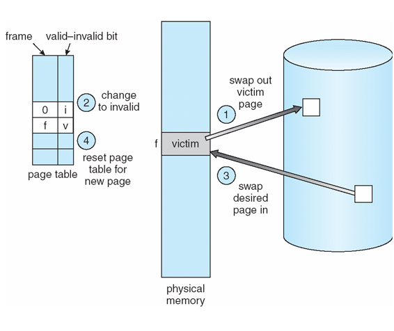
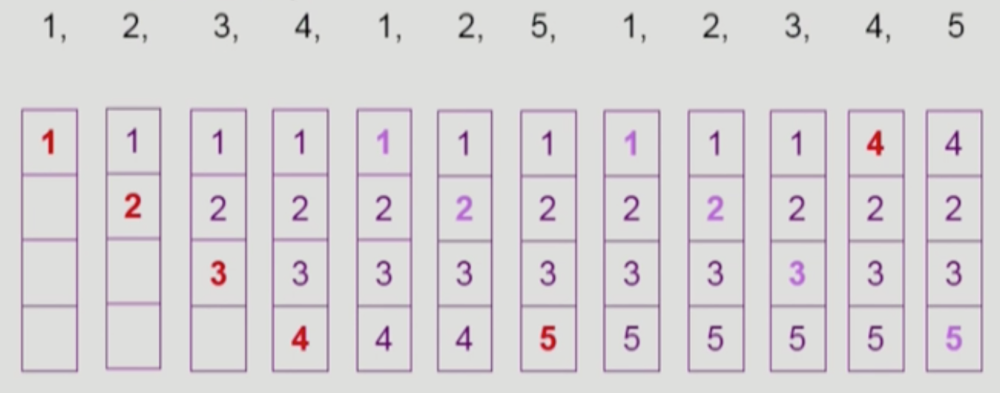
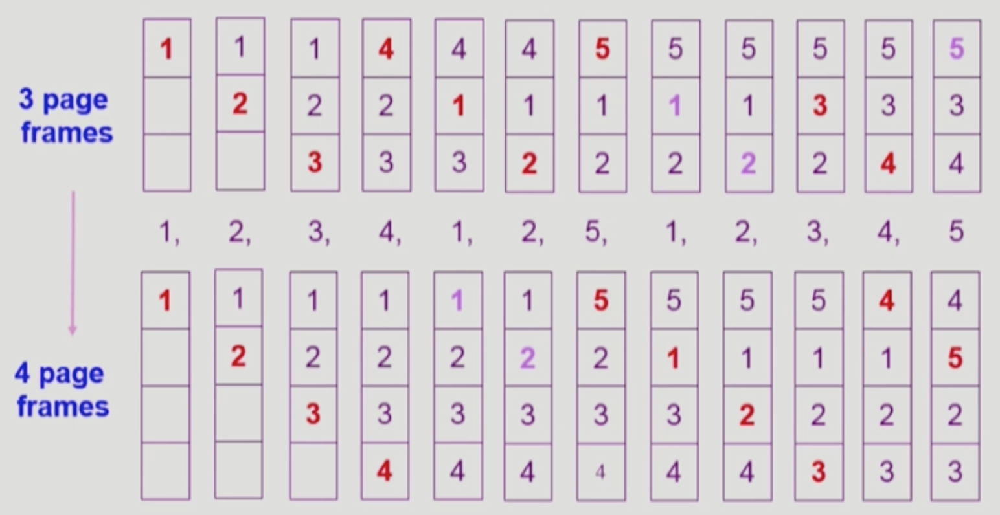
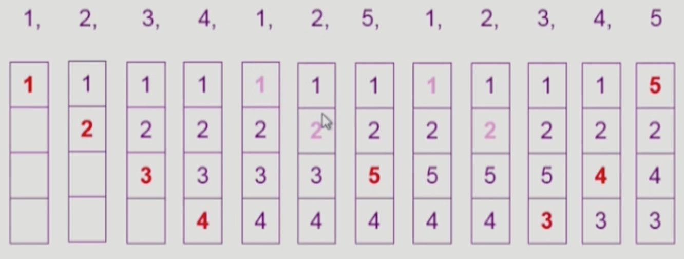
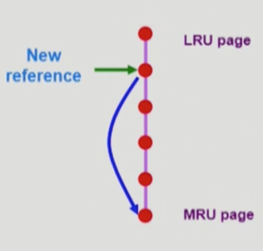
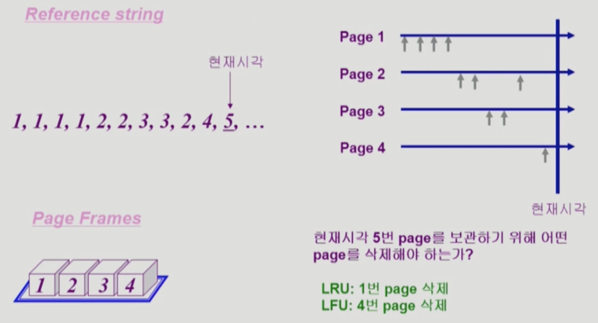
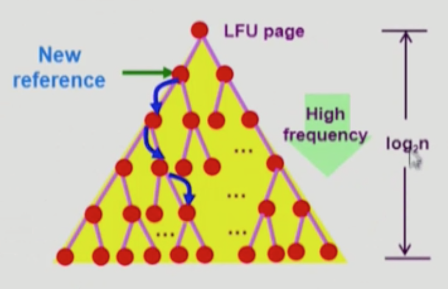

# 가상 메모리 Part 2

## 페이지 교체

비어있는 프레임이 없는 경우에는 프레임을 빼앗아와야 한다.(victim page)
곧바로 사용하지 않을 페이지를 쫓아내는 것이 좋음
동일한 페이지가 여러 번 메모리에서 쫓겨나고 돌아오는 일이 반복될 수 있음

페이지 교체 알고리즘을 통해 어떤 페이지를 쫓아낼 지 결정한다. 페이지 폴트율을 최소화하는 것이 목표.
reference string: `1 2 3 4 1 2 5 1 2 3 4 5`

## 페이지 교체 알고리즘

### Optimal Page Replacement (OPT)

페이지 폴트 6회 발생

- 가장 오랫동안 사용되지 않을 페이지를 찾아 교체하는 방식
- 페이지 폴트가 가장 적은 좋은 알고리즘, 그러나 미래를 알고 있다는 가정이 비현실적
- 다른 알고리즘 성능에 대한 upper bound 제공
- 다른 이름: offline, Belady's, MIN, OPT

### FIFO

페이지 폴트 9회 -> 10회

먼저 들어온 것을 먼저 내쫓는 방식

FIFO anomaly(Belady's anomaly): 페이지 프레임 수를 늘렸는데도 페이지 폴트가 더 발생하는 경우가 있다.

### LRU

페이지 폴트 8회

Least-Recently-Used Algorithm

미래를 모른다면 과거를 보라. 과거에 가장 오랫동안 사용되지 않은 페이지를 내쫓는다. 최근에 사용했을수록 앞으로도 다시 사용할 확률이 높다는 가정.

#### 구현

스택 형태로, 페이지가 참조될 때마다 페이지 번호는 스택의 bottom에 놓이게 된다. top에 있는 것이 가장 오랫동안 참조되지 않은 페이지로서 제거될 대상이다. 링크드 리스트 형태로 구현한다고 해도 O(1) 복잡도이다.

### LFU

Least-Frequently-Used Algorithm

참조 횟수(빈도)가 가장 적은 페이지를 내쫓는다.

특징
- LRU처럼 시점만 보는게 아니라 장기적인 시간을 보기 때문에 페이지 인기도를 더 정확히 판단
- 반대로 최근성은 반영 못함
- 구현이 더 복잡

#### 구현

LRU처럼 연결 리스트 기반의 스택으로 구현하면 매번 참조횟수를 비교해야 하므로 복잡도가 O(n)이 된다. 따라서 스택 대신 힙 형태로 구현한다. 최상단 노드가 참조횟수가 가장 적은 것이고 아래로 갈수록 많은 것이다. 이 경우 복잡도는 O(logn)이다.

### Clock Algorithm

## References

- [[강의] 운영체제, 반효경, 이화여자대학교, 2017 - KOCW](http://www.kocw.net/home/search/kemView.do?kemId=1226304)
- Operating System Concepts (8th Edition), Abraham Silberschatz, 홍릉과학출판사
