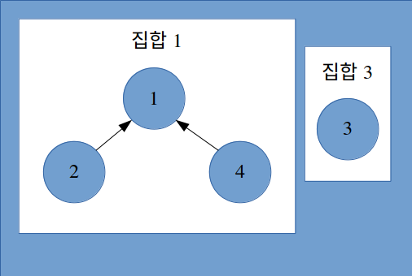

# 그래프 탐색 알고리즘

## 너비 우선 검색(Breadth First Search)
가장 단순한 그래프 탐색 알고리즘 중 하나로, 프림(prim)의 **최소 신장 트리 알고리즘**, 다익스트라(Dijkstra)의 **단일 출발점 최단 경로 알고리즘**의 원형이다.

### 탐색 방법
그래프 *G* = (*V*, *E*)에서 **출발점** *s*에 대해 *s*에서 닿을 수 있는 모든 정점을 가지는 **너비 우선 트리**를 만들어 낸다. 너비를 우선한다는 의미는 *s*로부터 거리가 *k* + 1인 한 정점을 만나기 전에 거리가 *k*인 정점을 모두 발견한다는 뜻이다.

탐색의 진행 정도를 따지기 위해 각 정점을 `흰색(WHITE)`에서 `회색(GRAY)`, 마지막으로 `검은색(BLACK)`으로 만든다.
- 흰색: 정점의 초기화 색.
- 회색: 인접한 정점이 흰색일 수도 있는 **경계점**.
- 검은색: 인접한 정점이 모두 탐색된 것을 나타냄.

너비 우선 탐색은 더 이상 탐색할 것이 없는 상태까지 탐색하는데, 이 때 이용하는 것이 **회색 정점으로 이루어진 큐 자료구조**이다.

### 의사 코드(인접 리스트)
``` Swift
BFS(G, s) {
  // 초기화 작업
  for 각각의 정점 u in G.V - {s} {
    u.color = WHITE
    u.d = ∞
    u.π = nil
  }
  s.color = GRAY
  s.d = 0
  s.π = nil
  Queue = ø
  Enqueue(Queue, s)

  // 회색 정점이 사라질 때까지
  // 즉, 모든 점을 탐색할 때까지
  while !Queue.isEmpty() {
    u = Dequeue(Queue)

    // u의 인접 정점을 검사해 흰색 정점을 탐색
    for 각각의 v in G.Adj[u] {
      if v.color == WHITE {
        v.color = GRAY
        v.d = u.d + 1 // 시작점 s로부터의 거리
        v.π = u // 정점 v의 직전 원소 u를 기록
        Enqueue(Queue, v)
      }
    }
    u.color = BLACK
  }
}
```

- 인접 리스트: 모든 정점을 방문하여 그에 인접한 간선들을 조사하므로 시간복잡도는 O(|V| + |E|)라 할 수 있다.
- 인접 행렬: 마찬가지로 모든 정점을 방문하여, 그에 인접한 간선들을 조사하는데, 인접 행렬의 특성 상 모든 간선들을 한 번씩 탐색해야 하므로 결국 O(|V|<sup>2</sup>)라 할 수 있다.

### 최단 경로
정점 *s*에서 정점 *v*로 가는 최단 경로를 구하고 싶을 때 너비 우선 탐색을 사용하면 유용하다. 위의 코드에서 `d(distance)`가 두 정점 간의 최단 경로가 된다.

## 깊이 우선 탐색(Depth First Search)
너비 우선 탐색과 달리 가능한 한 **더 깊이** 파고드는 탐색 방법이다. **재귀**를 사용하는 방식과 **스택**을 이용하는 방식 두 가지가 있다.

### 탐색 방법
쉽게 말해서, 더 탐색할 것이 없을 때까지 나아가고 없다면 다시 원래 자리로 돌아와 다시 탐색을 시작한다.

너비 우선 탐색과 마찬가지로 정점의 상태를 나타내는 `흰색(WHITE)`, `회색(GRAY)`, `검은색(BLACK)`을 칠한다.
- 흰색: 정점의 초기화 색
- 회색: **발견되었을 때**의 색.
- 검은색: 인접 리스트가 **모두 탐색되었을 때**의 색.

색 말고도 깊이 우선 탐색에서는 **시간 기록**을 한다. 각 정점은 처음 발견되었을 때 `v.d`와 인접 리스트의 조사를 마쳤을 때의 `v.f`를 갖는다. 따라서 어떠한 정점 *u*은 시간 `u.d` 전에는 **흰색**, 시간 `u.d`와 `u.f` 사이에는 **회색**, 그 이후에는 **검은색**을 가진다고 할 수 있다.

### 의사 코드
#### 인접 리스트 - 재귀
``` Swift
// 시간을 기록하기 위한 전역 변수
var time = 0

DFS(G) {
  // 초기화 작업
  for 각 정점 u in G.V {
    u.color = WHITE
    u.π = nil
  }

  for 각 정점 u in G.V {
    if u.color == WHITE {
      DFS-VISIT(G, u)
    }
  }
}

DFS-VISIT(G, u) {
  // 흰색 정점 u가 막 발견됨.
  time = time + 1
  u.d = time
  u.color = GRAY

  // 간선 (u, v)를 탐색한다.
  for 각각의 v in G.Adj[u] {
    if v.color == WHITE {
      v.π = u
      DFS-VISIT(G, v)
    }
  }

  // u의 인접 리스트를 모두 탐색 완료.
  u.color = BLACK
  time = time + 1
  u.f = time
}
```

#### 인접리스트 - 스택
``` Swift
var time = 0

DFS(G, s) {
  for 각 정점 u in G.V {
    u.color = WHITE
  }

  Stack = ø
  s.color = GRAY
  Push(Stack, s)
  while !Stack.isEmpty() {
    u = Pop(Stack)
    u.color = BLACK

    for 각각의 정점 v in G.Adj[u] {
      if v.color == WHITE {
        v.color = GRAY
        Push(Stack, v)
      }
    }
  }
}
```

- 인접 리스트: 너비 우선 탐색과 마찬가지로 각 정점을 한 번씩 방문하는데에 O(|V|), 그리고 방문한 정점에 대해서 인접한 간선들을 조사하는 데 총 O(|E|)가 걸리기 때문에 시간복잡도는 O(|V| + |E|)이다.
- 인접 행렬: 역시 개념은 같으나 간선 조사 시 모든 정점으로 가는 간선들을 조사해야 하므로 O(|V<sup>2</sup>|)가 된다.

## 최소 신장 트리(Minimum Spanning Tree)
그래프 *G* = (*V*, *E*)에서 각 간선에 가중치 *w*를 둔다. 이 **가중치의 합을 최소로 하고 모든 정점을 연결하는 트리**를 최소 신장 트리라고 한다. 이 트리를 결정하는 문재를 해결하는 알고리즘으로 **크루스칼 알고리즘**, **프림 알고리즘**이 존재한다.

이 두 알고리즘은 **그리디 알고리즘**을 사용한다. 이 알고리즘은 그 순간마다 최선의 선택을 하는데, 이는 항상 문제의 최적해를 구한다는 보장은 없다. 그러나 **최소 신장 트리 문제에서는 특정 그리디 방법을 사용하면** 최소 가중치의 신장 트리를 얻을 수 있다.

### 일반 해결법
그리디 알고리즘을 통해 최소 신장 트리 문제를 해결하는 방법은 모든 정점을 이을 때까지 한 번에 하나의 간선을 추가하는 방식으로 이루어 지고 간선의 집합 *A*를 유지한다. 이 때 **가장 중요한 것은 *A*가 최소 신장 트리의 부분 집합**이라는 것이다.

간선을 추가할 때 기존의 간선 집합 *A*에 하나의 간선 (*u*, *v*)를 추가한 A∪{(*u*, *v*)}도 최소 신장 트리의 부분 집합임을 만족해야 하는데 이러한 특성을 만족시키는 간선 (*u*, *v*)을 `안전 간선(safe edge)`라고 한다.

### 크루스칼 알고리즘
알고리즘이 동작하는 방식은 다음과 같다.
1. 가중치 *w*의 오름차순으로 *E*의 간선을 정렬한다.
2. 정렬된 순서대로 간선을 선택한다.
    - 이 때, **사이클을 형성하면 트리가 아니므로 사이클이 생성되지 않는 경우에만 간선을 택한다**.

사이클을 검사하는 것은 `DFS`를 사용하는 방법과 `Union-Find` 자료구조를 사용하는 방법 두 개가 있다.

#### DFS
``` Java
public static boolean hasCycleByDFS(ArrayList<ArrayList<Vertex>> graph, Vertex s) {
    ArrayList<Vertex> visitedList = new ArrayList<>();
    Stack<Vertex> stack = new Stack<>();

    stack.push(s);
    while (!stack.empty()) {
        Vertex checkingVertex = stack.pop();
        for (Vertex adjVertex: graph.get(checkingVertex.value)) {
            if (adjVertex.visited == false) {
                stack.push(adjVertex);
            }
        }

        checkingVertex.visited = true;
        visitedList.add(checkingVertex);
    }

    return visitedList.stream()
            .filter($0 -> visitedList.indexOf($0) != visitedList.lastIndexOf($0))
            .count() != 0;
}
```

`DFS` 방식은 모든 정점을 한 번씩 다 방문하는 방식이기 때문에 O(|V|)의 시간이 걸린다고 할 수 있다. 이는 상대적으로 느린 방식이기 때문에 다른 방법인 `Union-Find` 방식을 사용한다.

#### Union-Find
`Union-Find`는 **공통 원소가 없는 "상호 배타적"인 부분 집합들로 나누어진 원소들에 대한 정보를 조작하고 저장하는 자료구조**이다.

이 자료구조가 동작하기 위해 두 가지 연산이 필요하여 이름이 붙여지게 되었다.
- 초기화: *N*개의 원소들이 각각의 집합에 포함되어 있도록 초기화 한다.
- 합치기(Union): 두 원소 *a*, *b*를 주었을 때 이들이 속한 두 집합을 합친다.
- 찾기(Find): 원소 *a*가 주어졌을 때, 이것이 속한 집합을 반환한다.

`Union-Find` 자료구조의 구현은 주로 `트리(Tree)`를 사용하며 `배열(Array)`은 `Find` 연산의 O(1)이라는 빠른 속도에도 불구하고 보다 많이 수행되는 `Union` 연산이 O(n) 시간이 걸려 사용하지 않는다.

**트리에서는 각 집합이 각 트리의 루트 노드로 표현된다.**



`트리(Tree)`를 사용하면 연산은 다음과 같다.
- 초기화: 원소 각각이 **루트 노드**가 된다. 즉, 원소 갯수만큼의 트리를 가진다.
- 합치기: 각 트리의 루트를 찾은 뒤, **다르다면**(찾기 연산이 사용됨.) 하나의 트리에 몰아 넣는다.
- 찾기: 원소가 포함된 트리를 찾는다. 즉, 원소가 속한 트리의 **루트 노드**를 찾는다.

크루스칼 알고리즘에서 사이클이 형성되는지 알아보는 것이 **찾기 연산**, 그리고 형성되지 않을 시 결합하는 연산이 **합치기 연산**이다.

``` Java
public static void initialize(Vertex[] vertexArray) {
    for (Vertex vertex: vertexArray) {
      rootNodes[vertex.value] = vertex;
    }
}

public static Vertex find(Vertex vertex) {
    // rootNodes는 루트 노드를 모아놓은 집합.
    if (rootNodes[vertex.value] == vertex)
        return vertex;

    return vertex.parent = find(vertex.parent);
}

public static void union(Vertex vertex1, Vertex vertex2) {
    Vertex rootNode1 = find(vertex1);
    Vertex rootNode2 = find(vertex2);
    if (rootNode1 == rootNode2) return;

    // 시간 복잡도를 줄이기 위해 작은 트리를 큰 트리에 넣는다.
    if (rootNode1.getHeight() < rootNode2.getHeight()) {
      swap(rootNode1, rootNode2);
    }

    rootNode2.parent = rootNode1;
}
```

초기화 연산은 정점을 한 번씩 돌기 때문에 O(|V|)이다. 찾기와 합치기 연산은 크루스칼 알고리즘 시 각 간선마다 돌기 때문에 O(E)가 걸린다. 그러므로 총 걸리는 시간은 O(|V| + |E|)이다.

#### 최종 코드
``` Java
public static Edge[] kruskal(Graph graph) {
    ArrayList<Edge> minimumEdgeList = new ArrayList<>();

    // 초기화 작업.
    Vertex[] rootNodes = Arrays.copyOf(graph.vertexArray, graph.vertexArray.length);

    // 간선의 가중치의 오름차순으로 정렬.
    Edge[] sortedEdge = Arrays.sort(Arrays.copyOf(graph.edgeArray, graph.edgeArray.length),
            new Comparator<Edge>() {
                @Override
                public int compare(Edge o1, Edge o2) {
                    if (o2.cost > o1.cost) {
                        return 1;
                    } else if (o2.cost < o1.cost) {
                        return -1;
                    }

                    return 0;
                })
            });

    for (Edge edge: sortedEdge) {
        union(edge.vertex1, edge.vertex2);
    }

    return minimumEdgeList.toArray(new Edge[minimumEdgeList.size()]);
}
```
