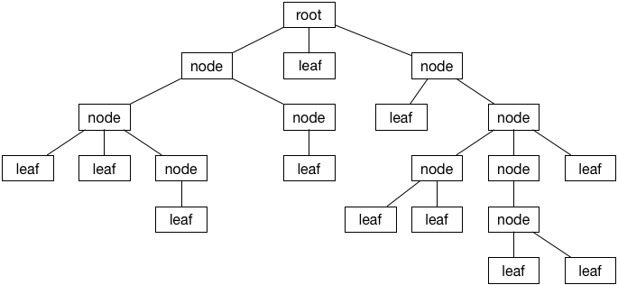
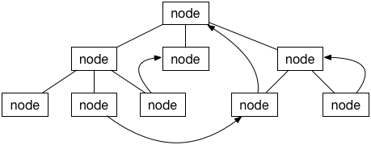
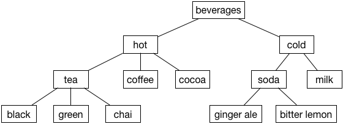

# 트리 (Tree)



트리는 객체들 간의 계층적인 관계를 나타내는 자료구조이다. 트리는 노드(node)들로 구성되어 있고 노드들은 링크(link)를 통하여 서로 연결되어 있는 모양이다.

각 노드들은 자식(children) 노드 또는 부모(parent) 노드와 연결되어 있다. 자식 노드란 어떤 노드의 아래쪽에 위치한 노드를 뜻하고, 부모 노드란 위쪽에 위치한 노드를 뜻한다. 하나의 노드는 하나의 부모만 가질 수 있고 자식은 여러 개 가질 수 있다.

노드 중에 부모 노드가 없고 최상단에 위치한 것을 루트(root) 노드라고 한다. 반대로 하단에 위치하고 자식이 없는 노드를 리프(leaf) 노드라고 한다.

## 관련 용어
- 경로(Path): 간선(엣지)로 연결된, 즉 인접한 노드들로 이뤄진 시퀀스(sequence)를 가리킴.
- 경로의 길이(Length): 경로에 속한 엣지의 갯수.
- 높이(Height): 루트 노드로부터 리프 노트에 이르는 가장 긴 경로의 `잎 노드 레벨 + 1`.
- 레벨(Level): 루트 노드로부터의 거리.
- 형제(Sibling): 부모가 같은 노드.

## 속성
트리는 `루트 노드를 제외한 모든 노드는 단 하나의 부모 노드만을 가진다.`라는 중요한 특성을 만족한다. 이는 트리가 다음과 같은 특성을 보이게 한다.

- 임의의 노드에서 다른 노드로 가는 경로(Path)는 유일하다.
- 회로(Cycle)은 존재하지 않는다.
- 모든 노드는 연결되어 있다.
- 엣지를 하나 자르면 트리가 두 개로 분리된다.
- 엣지의 수 |E|는 노드의 수 |V|에서 **1을 뺀 것**과 같다.

이제 다음 그림을 보자.



위와 같이 생긴 자료구조는 (트리가 아니라) 그래프이다. 왜냐하면 `사이클`이 존재하기 때문이다. 트리는 그래프를 단순화한 형태라고 볼 수 있다. 비슷한 맥락에서 연결 리스트는 트리를 단순화한 형태라고 볼 수 있다. 이 글에서는 트리의 가장 일반적이고 제약 없는 형태에 대하여 이야기할 것이다. 여기서 제약이란 최대 자식 노드의 개수, 노드의 순서 등을 말한다.

## 트리 구현

가장 기본적인 형태의 트리이다. 제네릭 타입의 값인 `value`와 부모 노드의 레퍼런스인 `parent`, 그리고 자식 노드들의 레퍼런스 배열인 `children`로 구성되어 있다.

```swift
public class TreeNode<T> {
  public var value: T

  public weak var parent: TreeNode?
  public var children = [TreeNode<T>]()

  public init(value: T) {
    self.value = value
  }

  public func addChild(_ node: TreeNode<T>) {
    children.append(node)
    node.parent = self
  }
}
```

`print()`하였을 때 보기 편하도록 `description`이라는 헬퍼 메서드를 구현한다.

```swift
extension TreeNode: CustomStringConvertible {
  public var description: String {
    var s = "\(value)"
    if !children.isEmpty {
      s += " {" + children.map { $0.description }.joined(separator: ", ") + "}"
    }
    return s
  }
}
```

## 트리 예시

여러 개의 노드를 만들어서 직접 트리를 만들어보자.

```swift
let tree = TreeNode<String>(value: "beverages")

let hotNode = TreeNode<String>(value: "hot")
let coldNode = TreeNode<String>(value: "cold")

let teaNode = TreeNode<String>(value: "tea")
let coffeeNode = TreeNode<String>(value: "coffee")
let chocolateNode = TreeNode<String>(value: "cocoa")

let blackTeaNode = TreeNode<String>(value: "black")
let greenTeaNode = TreeNode<String>(value: "green")
let chaiTeaNode = TreeNode<String>(value: "chai")

let sodaNode = TreeNode<String>(value: "soda")
let milkNode = TreeNode<String>(value: "milk")

let gingerAleNode = TreeNode<String>(value: "ginger ale")
let bitterLemonNode = TreeNode<String>(value: "bitter lemon")

tree.addChild(hotNode)
tree.addChild(coldNode)

hotNode.addChild(teaNode)
hotNode.addChild(coffeeNode)
hotNode.addChild(chocolateNode)

coldNode.addChild(sodaNode)
coldNode.addChild(milkNode)

teaNode.addChild(blackTeaNode)
teaNode.addChild(greenTeaNode)
teaNode.addChild(chaiTeaNode)

sodaNode.addChild(gingerAleNode)
sodaNode.addChild(bitterLemonNode)
```

완성된 트리의 `description` 메서드를 호출하여 `print()`해보면 찍히는 결과와 이것을 그림으로 표현한 것은 다음과 같다.

```
beverages {hot {tea {black, green, chai}, coffee, cocoa}, cold {soda {ginger ale, bitter lemon}, milk}}
```



`beverages` 노드는 루트 노드이다. 그리고 리프 노드로는 `black`, `green`, `chai`, `coffee`, `cocoa`, `ginger ale`, `bitter lemon`, `milk`가 있다.

노드의 `parent` 프로퍼티에 접근하여 부모 노드를 들여다 볼 수 있다.

```swift
teaNode.parent           // this is the "hot" node
teaNode.parent!.parent   // this is the root
```

## 트리의 높이

트리의 높이란 루트 노드와 최하단에 위치한 리프 노드 사이의 링크의 개수를 의미한다. 앞선 예시에서 트리의 높이는 3이다. 바닥에서 꼭대기까지 닿으려면 세 번 이동해야 하기 때문이다.

## 노드의 깊이

노드의 깊이란 특정 노드로부터 루트 노드까지의 거리를 뜻한다. 트리의 높이와 비슷한 개념이지만 최하단 리프 노드 뿐 아니라 어떤 노드든 기준점이 될 수 있다. 루트 노드의 깊이는 0이다.

## 트리의 종류

## References

- [Tree - Swift Algorithm Club](https://github.com/raywenderlich/swift-algorithm-club/tree/master/Tree)
